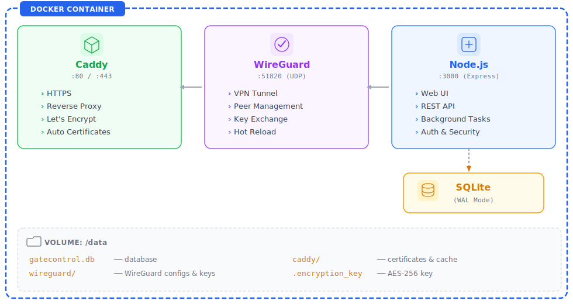

# GateControl

🇬🇧 **English** | 🇩🇪 [Deutsch](README.de.md)

**Unified WireGuard VPN + Caddy Reverse Proxy Management**

GateControl is a self-hosted, containerized management platform that combines WireGuard VPN peer management with Caddy reverse proxy routing in a single, security-focused web interface. It is designed for self-hosters and small teams who want full control over their VPN infrastructure and reverse proxy configuration without juggling multiple tools or editing config files manually.

---

## Table of Contents

- [Features](#features)
- [How It Works](#how-it-works)
- [Architecture](#architecture)
- [Security](#security)
- [Quick Start](#quick-start)
- [Installation](#installation)
- [Configuration](#configuration)
- [Usage](#usage)
- [Companion Projects](#companion-projects)
- [Tech Stack](#tech-stack)
- [Development](#development)
- [License](#license)

---

## Features

### VPN Peer Management
- Create, edit, enable/disable, and delete WireGuard peers through a clean web UI
- Automatic key generation (private key, public key, preshared key) — no manual key handling
- Automatic IP allocation from a configurable subnet (default `10.8.0.0/24`)
- Downloadable peer configuration files and scannable QR codes for mobile clients
- Real-time peer status monitoring (online/offline detection via WireGuard handshake)
- Peer tagging for organization
- Hot-reload configuration changes via `wg syncconf` — no VPN restart needed

### Reverse Proxy Routing (Layer 7)
- Domain-based reverse proxy routes powered by Caddy
- Automatic HTTPS with Let's Encrypt certificates — zero-configuration TLS
- Optional Basic Authentication per route
- **Route Authentication** — Custom login page per route with multiple auth methods: Email & Password, Email & Code (OTP via SMTP), TOTP (Authenticator App). Optional Two-Factor Authentication (2FA) with configurable session duration
- **Custom Branding** — Upload logo, set title, welcome text, accent/background color, and background image per route auth login page
- **IP Access Control / Geo-Blocking** — Per-route IP/CIDR whitelist or blacklist with optional country-based filtering via ip2location.io integration
- Backend HTTPS support for targets with self-signed certificates (e.g., Synology DSM on port 5001)
- Link routes directly to VPN peers — the route automatically targets the peer's WireGuard IP
- Atomic configuration sync to Caddy with automatic rollback on failure

### Layer 4 TCP/UDP Proxy
- Raw TCP and UDP port forwarding via [caddy-l4](https://github.com/mholt/caddy-l4) plugin
- Reach services like RDP, SSH, databases, or game servers through GateControl — without requiring the client to be inside the VPN
- Three TLS modes per route: **None** (direct port forwarding), **Passthrough** (TLS-SNI routing without termination), **Terminate** (Caddy handles TLS with Let's Encrypt)
- Multiple services on the same port via TLS-SNI routing — e.g., `ssh.example.com:8443` and `db.example.com:8443`
- Port ranges supported (e.g., `5000-5010` for multi-port services)
- Blocked port protection prevents accidentally binding to system ports (80, 443, 2019, 3000, 51820)
- Link L4 routes to WireGuard peers — same peer dropdown as HTTP routes
- Host networking (`network_mode: host`) for dynamic port binding without container restart

### Uptime Monitoring
- **Backend service monitoring** with HTTP and TCP health checks per route
- Configurable check interval with per-route enable/disable toggle
- Dashboard widget showing monitored routes with real-time status (up/down/unknown)
- Automatic email alerts on route down/recovery events (integrates with Email Alerts)
- Checks run in background — no impact on request handling

### Monitoring & Logging
- Real-time traffic monitoring with upload/download statistics per peer
- **Per-peer traffic history** with persistent totals and interactive charts (24h, 7d, 30d)
- Dashboard with system metrics: connected peers, active routes, CPU, RAM, uptime
- Traffic charts with 1-hour, 24-hour, and 7-day views
- **Health check endpoint** (`/health`) verifying database and WireGuard status
- Full activity log with severity levels and filtering (peer created, route modified, login events, etc.)
- Caddy access log with automatic rotation (10 MB, keep 3 files)

### Security Settings
- **Configurable account lockout** — lock accounts after N failed login attempts for a configurable duration (applies to both admin and route-auth login)
- **Manual unlock** — view and unlock locked accounts directly from the Settings page
- **Password complexity enforcement** — configurable rules for minimum length, uppercase letters, numbers, and special characters
- All security settings manageable through the web UI (Settings > Security)

### Backup & Restore
- Full system backup as portable JSON (peers, routes, route auth configs, settings, webhooks)
- **Encryption key validation** on restore — prevents silent failures when restoring on a different instance
- Encrypted keys are decrypted for export portability — restore on any instance
- Atomic transaction-based restore with automatic WireGuard and Caddy resync
- Backup versioning for forward compatibility

### Email Alerts
- Event-based email notification system — any activity event can trigger an email alert
- Configurable per event group via Settings > Email Alerts
- Periodic checks: backup reminders (no backup in N days), CPU/RAM threshold alerts (hourly)
- All alerts use the existing SMTP service

**Alert Event Groups:**

| Group | Events | Triggers |
|-------|--------|----------|
| **Security** | `login_failed`, `account_locked`, `password_changed` | Failed admin login, account lockout triggered, password changed |
| **Peers** | `peer_connected`, `peer_disconnected`, `peer_created`, `peer_deleted` | Peer comes online/goes offline via WireGuard handshake, peer added/removed |
| **Routes** | `route_down`, `route_up`, `route_created`, `route_deleted` | Uptime monitor detects route down/recovered, route added/removed |
| **System** | `system_start`, `wg_restart`, `backup_restored`, `backup_reminder`, `resource_alert` | Application started, WireGuard restarted, backup restored, no backup in N days, CPU/RAM above threshold |

### Webhooks
- Event-driven notifications to external services
- Subscribe to specific events or use wildcard (`*`) for all events
- URL validation blocks private/internal IP ranges to prevent SSRF with DNS rebinding protection
- JSON payloads with event type, message, details, and timestamp

### Internationalization
- Full English and German language support (400+ translation keys)
- Covers all UI elements: navigation, forms, status messages, error messages, dialogs

### API Tokens
- **Stateless token authentication** for automation, CI/CD pipelines, and external integrations
- Scoped permissions: `full-access`, `read-only`, or per-resource (`peers`, `routes`, `settings`, `webhooks`, `logs`, `system`, `backup`)
- Token management in Settings (create, list, revoke) — token value shown only once on creation
- Secure storage: only SHA-256 hash stored in database, `gc_` prefix for easy identification
- Accepted via `Authorization: Bearer gc_xxx` or `X-API-Token: gc_xxx` header
- Tokens cannot create other tokens (prevents privilege escalation)
- Rate limiting per token ID

### Responsive UI
- **Mobile sidebar** with hamburger menu for phones and tablets (< 1024px)
- Slide-in animation with overlay backdrop, focus trap, and keyboard navigation (Escape to close)
- Desktop layout unchanged — sidebar always visible on large screens

### SMTP Configuration
- Built-in SMTP settings for sending email verification codes
- Configurable via web UI (host, port, user, password, sender, TLS)
- Test email functionality to verify SMTP configuration

---

## How It Works

GateControl runs as a single Docker container that orchestrates three services via Supervisord:

<p align="center">
  
</p>

### Startup Sequence

1. **Entrypoint** validates required environment variables and enables IP forwarding
2. **WireGuard keypair** is generated on first run and persisted to `/data/wireguard/`
3. **AES-256 encryption key** is generated (or loaded from previous run) and stored at `/data/.encryption_key`
4. **Supervisord** starts three processes in order:
   - **Caddy** (priority 10) — reverse proxy with automatic HTTPS
   - **WireGuard** (priority 20) — VPN interface via `wg-quick up`
   - **Node.js** (priority 30) — web application with background tasks
5. **Background tasks** begin: traffic collection (every 60s), peer status polling (every 30s), data cleanup (every 6h)
6. **Existing routes** are synced to Caddy after a 5-second startup delay

### Traffic Flow

**VPN Client → Internet:**
```
Client Device → WireGuard Tunnel (encrypted) → GateControl Container → iptables NAT → Internet
```

**External Request → Internal Service (via HTTP reverse proxy):**
```
Browser → Caddy (HTTPS/Let's Encrypt) → WireGuard Peer IP:Port → Internal Service
```

**External Request → Internal Service (via Layer 4 proxy, e.g., RDP):**
```
RDP Client → Caddy L4 (TCP/:3389) → WireGuard Peer IP:3389 → Windows VM
```

This means you can expose internal services (behind your VPN) to the internet — HTTP services with automatic HTTPS, or raw TCP/UDP services (RDP, SSH, databases) via Layer 4 proxying. Caddy routes traffic through the WireGuard tunnel to reach services running on peer devices, without opening ports on your internal network.

---

## Architecture

```
src/
├── server.js              # Application entry point, background tasks, graceful shutdown
├── app.js                 # Express setup, security middleware, template engine
├── db/
│   ├── connection.js      # SQLite with WAL mode and performance pragmas
│   ├── migrations.js      # Versioned migrations with history tracking (15 migrations)
│   └── seed.js            # Admin user initialization on first run
├── services/              # Business logic layer
│   ├── peers.js           # Peer CRUD, key generation, IP allocation, WG sync
│   ├── wireguard.js       # WireGuard CLI wrapper (wg, wg-quick, wg syncconf)
│   ├── routes.js          # Route CRUD, Caddy JSON config builder, admin API sync
│   ├── l4.js              # Layer 4 server grouping, config generation, conflict detection
│   ├── traffic.js         # Periodic traffic snapshots, per-peer and aggregate chart data
│   ├── lockout.js         # Account lockout tracking and enforcement
│   ├── peerStatus.js      # Background peer online/offline polling
│   ├── activity.js        # Activity event logging with severity levels
│   ├── accessLog.js       # HTTP access log processing
│   ├── settings.js        # Key-value settings persistence
│   ├── backup.js          # Full backup/restore with atomic transactions
│   ├── email.js           # SMTP email service (OTP delivery, test emails)
│   ├── routeAuth.js       # Route authentication (sessions, OTP, TOTP, CSRF)
│   ├── webhook.js         # Event-driven webhook delivery
│   ├── tokens.js          # API token CRUD, SHA-256 hashing, scope enforcement
│   ├── qrcode.js          # QR code generation for peer configs
│   └── system.js          # System info (CPU, RAM, uptime, disk)
├── routes/
│   ├── index.js           # Page routes (dashboard, peers, routes, logs, settings)
│   ├── auth.js            # Login/logout handlers
│   ├── routeAuth.js       # Public route auth endpoints (verify, login, logout)
│   └── api/               # RESTful API endpoints
│       ├── peers.js       # /api/peers — CRUD, toggle, sync, config export, traffic charts
│       ├── routes.js      # /api/routes — CRUD, toggle
│       ├── routeAuth.js   # /api/routes/:id/auth — route auth config CRUD
│       ├── smtp.js        # /api/smtp — SMTP settings management
│       ├── dashboard.js   # /api/dashboard — stats, traffic, charts
│       ├── settings.js    # /api/settings — get/set, security settings, lockout management
│       ├── logs.js        # /api/logs — activity + access logs with filtering
│       ├── wireguard.js   # /api/wg — status, restart
│       ├── caddy.js       # /api/caddy — status, reload
│       ├── webhooks.js    # /api/webhooks — CRUD
│       ├── tokens.js      # /api/tokens — API token management
│       └── system.js      # /api/system — system info
├── middleware/
│   ├── auth.js            # Session-based authentication guards
│   ├── csrf.js            # CSRF token protection (csrf-sync)
│   ├── i18n.js            # Language detection and translation injection
│   ├── rateLimit.js       # Rate limiting (login + API)
│   ├── sessionStore.js    # SQLite-backed session storage
│   └── locals.js          # Template variable injection
├── utils/
│   ├── crypto.js          # AES-256-GCM encryption, WireGuard key generation
│   ├── ip.js              # IP allocation from WireGuard subnet
│   ├── logger.js          # Structured logging via Pino
│   └── validate.js        # Input validation (domains, IPs, names)
└── i18n/
    ├── en.json            # English translations
    └── de.json            # German translations
```

---

## Security

GateControl is built with a security-first approach across every layer.

### End-to-End Encryption

All VPN traffic between clients and the GateControl server is encrypted end-to-end through WireGuard's modern cryptography:

- **Noise Protocol Framework** for key exchange
- **Curve25519** for Elliptic-curve Diffie-Hellman (ECDH)
- **ChaCha20-Poly1305** for authenticated encryption (AEAD)
- **BLAKE2s** for hashing
- **SipHash24** for hashtable keys

Each peer connection uses a unique keypair plus an optional preshared key (generated by default) for post-quantum resistance.

### Data Encryption at Rest

Sensitive data stored in the database (private keys, preshared keys) is encrypted using **AES-256-GCM**:

- 256-bit key (auto-generated on first run, persisted to `/data/.encryption_key` with `chmod 600`)
- 96-bit random IV per encryption operation
- 128-bit authentication tag for integrity verification
- Ciphertext format: `iv:tag:encrypted` (hex-encoded)

### HTTPS & Let's Encrypt

Caddy automatically provisions and renews TLS certificates via **Let's Encrypt** for all configured routes:

- Zero-configuration HTTPS — just add a domain and Caddy handles the rest
- HTTP to HTTPS auto-redirect on all routes
- Custom ACME CA support (e.g., for internal PKI via `GC_CADDY_ACME_CA`)
- Certificate data persisted in `/data/caddy/` across container restarts

### Web Application Security

| Layer | Implementation |
|-------|---------------|
| **Authentication** | Session-based with Argon2 password hashing |
| **Account Lockout** | Configurable max attempts + lock duration for admin and route-auth login. Manual unlock via UI |
| **Password Complexity** | Configurable enforcement of min length, uppercase, numbers, special characters |
| **CSRF Protection** | Synchronizer token pattern via csrf-sync; domain-bound HMAC-signed tokens for route-auth with timing-safe comparison |
| **Rate Limiting** | 5 login attempts / 15 min, 100 API requests / 15 min per IP (configurable) |
| **Route Authentication** | Per-route auth with Email+Password, OTP, TOTP, 2FA. Argon2 password hashing, AES-256-GCM encrypted TOTP secrets |
| **Security Headers** | Helmet.js with strict Content Security Policy, HSTS, X-Frame-Options |
| **CSP Nonces** | Per-request `crypto.randomBytes(16)` nonce for inline scripts |
| **Session Cookies** | `HttpOnly`, `Secure`, `SameSite=Strict`, configurable max age |
| **Input Validation** | Server-side validation for domains, IPs, names, descriptions with field-level error feedback |
| **Webhook SSRF Protection** | Blocks requests to localhost, private IPs (10.x, 172.16-31.x, 192.168.x, 127.x, 169.254.x, 100.64-127.x CGNAT) with DNS rebinding protection |
| **Error Sanitization** | Detailed errors in development only; generic messages in production |

### Container Security

- Runs on Alpine Linux (minimal attack surface)
- WireGuard configuration files secured with `chmod 600`
- Encryption key file secured with `chmod 600`
- Only required capabilities: `NET_ADMIN` (network interface management) and `SYS_MODULE` (kernel module loading)
- Health check endpoint (`/health`) validates DB connectivity and WireGuard interface status
- Atomic WireGuard config writes (write-to-tmp + rename) prevent corruption on crash
- Graceful shutdown with cleanup of all background tasks and timers

---

## Quick Start

```bash
# Clone and start
git clone https://github.com/CallMeTechie/gatecontrol.git
cd gatecontrol
cp .env.example .env

# Edit .env — set at minimum:
#   GC_ADMIN_PASSWORD  (your admin password)
#   GC_WG_HOST         (your public IP or domain)
#   GC_BASE_URL        (https://your-domain.com)

docker compose up -d
```

GateControl will be available at your configured `GC_BASE_URL`.

---

## Installation

### Option 1: Online (recommended)

Download the setup files and run the interactive installer:

```bash
mkdir gatecontrol && cd gatecontrol

# Download setup files from the latest release
curl -fsSLO https://github.com/CallMeTechie/gatecontrol/releases/latest/download/setup.sh
curl -fsSLO https://github.com/CallMeTechie/gatecontrol/releases/latest/download/docker-compose.yml
curl -fsSLO https://github.com/CallMeTechie/gatecontrol/releases/latest/download/.env.example

# Run interactive setup (installs Docker if needed, pulls image from GHCR)
sudo bash setup.sh
```

The setup script will:
1. Detect your OS (Ubuntu, Debian, Fedora, CentOS, RHEL, Rocky, Alma, Alpine)
2. Install Docker and Docker Compose if not present
3. Pull the latest image from `ghcr.io/callmetechie/gatecontrol`
4. Walk you through configuration (domain, admin credentials, language, etc.)
5. Generate secure secrets automatically
6. Start the container

### Option 2: Offline

Download all release assets including the pre-built Docker image:

```bash
# Download all files from a specific release
curl -fsSLO https://github.com/CallMeTechie/gatecontrol/releases/download/v1.0.0/gatecontrol-image.tar.gz
curl -fsSLO https://github.com/CallMeTechie/gatecontrol/releases/download/v1.0.0/setup.sh
curl -fsSLO https://github.com/CallMeTechie/gatecontrol/releases/download/v1.0.0/docker-compose.yml
curl -fsSLO https://github.com/CallMeTechie/gatecontrol/releases/download/v1.0.0/.env.example

# Run setup — detects the tar.gz and loads it locally
sudo bash setup.sh
```

### Option 3: Docker Compose (manual)

```bash
git clone https://github.com/CallMeTechie/gatecontrol.git
cd gatecontrol
cp .env.example .env
# Edit .env with your values
docker compose up -d
```

### Updating

```bash
# Pull latest image
docker pull ghcr.io/callmetechie/gatecontrol:latest

# Restart with new image
docker compose down && docker compose up -d
```

Your data is persisted in the `gatecontrol-data` Docker volume and survives updates.

---

## Configuration

All configuration is done through environment variables in the `.env` file.

### Required Settings

| Variable | Description | Example |
|----------|-------------|---------|
| `GC_ADMIN_PASSWORD` | Admin login password | `MySecureP@ss!` |
| `GC_WG_HOST` | Public IP or domain for WireGuard | `vpn.example.com` |
| `GC_BASE_URL` | Full URL of the web interface | `https://gate.example.com` |

### Application

| Variable | Default | Description |
|----------|---------|-------------|
| `GC_APP_NAME` | `GateControl` | Application name shown in UI |
| `GC_HOST` | `0.0.0.0` | Listen address |
| `GC_PORT` | `3000` | Internal application port |
| `GC_SECRET` | auto-generated | Session secret (auto-generated if empty) |
| `GC_DB_PATH` | `/data/gatecontrol.db` | SQLite database path |
| `GC_LOG_LEVEL` | `info` | Log level (debug, info, warn, error) |

### Authentication

| Variable | Default | Description |
|----------|---------|-------------|
| `GC_ADMIN_USER` | `admin` | Admin username |
| `GC_SESSION_MAX_AGE` | `86400000` | Session lifetime in ms (24h) |
| `GC_RATE_LIMIT_LOGIN` | `5` | Max login attempts per 15 min |
| `GC_RATE_LIMIT_API` | `100` | Max API requests per 15 min |

### WireGuard

| Variable | Default | Description |
|----------|---------|-------------|
| `GC_WG_INTERFACE` | `wg0` | WireGuard interface name |
| `GC_WG_PORT` | `51820` | WireGuard listen port |
| `GC_WG_SUBNET` | `10.8.0.0/24` | VPN subnet for peer IP allocation |
| `GC_WG_GATEWAY_IP` | `10.8.0.1` | Server's VPN IP address |
| `GC_WG_DNS` | `1.1.1.1,8.8.8.8` | DNS servers pushed to clients |
| `GC_WG_ALLOWED_IPS` | `0.0.0.0/0` | Allowed IPs for peers (full tunnel) |
| `GC_WG_PERSISTENT_KEEPALIVE` | `25` | Keepalive interval in seconds |
| `GC_WG_MTU` | (empty) | Custom MTU (leave empty for auto) |

### Caddy / HTTPS

| Variable | Default | Description |
|----------|---------|-------------|
| `GC_CADDY_ADMIN_URL` | `http://127.0.0.1:2019` | Caddy admin API URL |
| `GC_CADDY_DATA_DIR` | `/data/caddy` | Caddy data directory (certs, cache) |
| `GC_CADDY_EMAIL` | (empty) | Email for Let's Encrypt registration |
| `GC_CADDY_ACME_CA` | (empty) | Custom ACME CA URL (for internal PKI) |

### Localization

| Variable | Default | Description |
|----------|---------|-------------|
| `GC_DEFAULT_LANGUAGE` | `en` | Default language (`en` or `de`) |
| `GC_DEFAULT_THEME` | `default` | UI theme |

### Network & Encryption

| Variable | Default | Description |
|----------|---------|-------------|
| `GC_NET_INTERFACE` | `eth0` | Host network interface for NAT rules |
| `GC_ENCRYPTION_KEY` | auto-generated | AES-256 key for database encryption |

### Layer 4 Proxy

| Variable | Default | Description |
|----------|---------|-------------|
| `GC_L4_BLOCKED_PORTS` | `80,443,2019,3000,51820` | Ports blocked for L4 routes (system ports) |
| `GC_L4_MAX_PORT_RANGE` | `100` | Maximum number of ports in a port range |

---

## Usage

### Web Interface

After starting GateControl, navigate to your configured `GC_BASE_URL` and log in with your admin credentials.

**Dashboard** — Overview of connected peers, active routes, traffic charts, and system metrics.

**Peers** — Create and manage WireGuard VPN peers. Each peer gets an auto-allocated IP, generated keys, and a downloadable configuration file with QR code. View per-peer traffic history with interactive charts (24h, 7d, 30d) and persistent upload/download totals.

**Routes** — Configure reverse proxy routes (HTTP) and Layer 4 proxy routes (TCP/UDP). Map external domains to internal services through your VPN peers. HTTP routes get automatic HTTPS via Caddy. L4 routes forward raw TCP/UDP traffic for services like RDP, SSH, or databases.

**Config** — View the current WireGuard configuration (private key masked).

**Caddy Config** — View the live Caddy reverse proxy JSON configuration with syntax highlighting. Export as JSON file.

**Certificates** — View SSL/TLS certificates managed by Caddy.

**Logs** — Browse activity logs and access logs with filtering by event type and severity.

**Settings** — System settings, security configuration (account lockout, password complexity), SMTP email configuration, backup/restore, and webhook management.

### API

All 68 management endpoints are available via REST API at `/api/v1/*` (with backward-compatible `/api/*` alias). Authenticate with session cookies or **API tokens** (`Authorization: Bearer gc_xxx`). All responses use a standardized `{ ok: true/false }` format.

```bash
# Session auth
curl -b cookies.txt https://gate.example.com/api/v1/peers

# API token auth (no CSRF needed)
curl -H "Authorization: Bearer gc_your_token" \
  https://gate.example.com/api/v1/peers

# Create a new peer
curl -H "Authorization: Bearer gc_your_token" \
  -X POST https://gate.example.com/api/v1/peers \
  -H "Content-Type: application/json" \
  -d '{"name": "my-laptop", "description": "Work laptop"}'
```

See **[API.md](API.md)** for the complete endpoint reference and **[API_GUIDE.md](API_GUIDE.md)** for practical integration examples (Home Assistant, Python, Node.js, Bash, Telegram/Discord bots, CI/CD, Prometheus).

### Networking

GateControl uses **host networking** (`network_mode: host`) so that Layer 4 routes can dynamically bind to new ports without restarting the container.

| Port | Protocol | Service |
|------|----------|---------|
| 80 | TCP | HTTP (auto-redirects to HTTPS) |
| 443 | TCP/UDP | HTTPS (Caddy reverse proxy) |
| 51820 | UDP | WireGuard VPN |
| *dynamic* | TCP/UDP | Layer 4 routes (configured via web interface) |

---

## Companion Projects

### docker-wireguard-go

**[docker-wireguard-go](https://github.com/CallMeTechie/docker-wireguard-go)** — WireGuard-Go Docker Client for Synology NAS (userspace, no kernel module required).

If you want to connect a Synology NAS to your GateControl VPN without kernel module support, use docker-wireguard-go as the WireGuard client. Create a peer in GateControl, download the configuration, and use it with docker-wireguard-go on your NAS. Combined with GateControl's reverse proxy routes, you can expose Synology services (DSM, Drive, Photos) to the internet with automatic HTTPS — without opening any ports on your NAS.

```
Internet → GateControl (HTTPS) → WireGuard Tunnel → docker-wireguard-go (NAS) → DSM :5001
```

Enable **Backend HTTPS** on the route for services that use self-signed certificates (like Synology DSM on port 5001).

---

## Tech Stack

| Component | Technology |
|-----------|-----------|
| **Runtime** | Node.js 20 (Alpine Linux) |
| **Framework** | Express.js 4.21 |
| **Database** | SQLite (better-sqlite3, WAL mode) |
| **VPN** | WireGuard (wireguard-tools) |
| **Reverse Proxy** | Caddy (automatic HTTPS) + caddy-l4 (TCP/UDP proxy) |
| **Template Engine** | Nunjucks |
| **Password Hashing** | Argon2 (admin), bcrypt (route basic auth) |
| **TOTP** | otpauth (RFC 6238) |
| **Encryption** | AES-256-GCM (Node.js crypto) |
| **Email** | Nodemailer (SMTP) |
| **Session Store** | SQLite-backed |
| **Security** | Helmet, csrf-sync, express-rate-limit |
| **Logging** | Pino |
| **Process Manager** | Supervisord |
| **Container** | Docker (Alpine) |
| **CI/CD** | GitHub Actions |
| **Registry** | GitHub Container Registry (GHCR) |

---

## Development

```bash
# Clone the repository
git clone https://github.com/CallMeTechie/gatecontrol.git
cd gatecontrol

# Install dependencies
npm install

# Start in development mode (auto-reload on file changes)
npm run dev

# Run tests
npm test
```

### Testing

```bash
# Run API integration tests (30+ tests across all endpoint groups)
npm test
```

Tests cover Auth, Peers, Routes, Dashboard, Settings, Webhooks, Logs, System, Health, and Backup endpoints. Tests are CI-compatible and skip tests requiring WireGuard/Caddy when not available.

### Requirements

- Node.js >= 20.0.0
- WireGuard tools (for full functionality)
- Caddy (for reverse proxy features)

### Project Structure

- `src/` — Application source code
- `public/` — Static frontend assets (CSS, JS, images)
- `templates/` — Nunjucks page templates
- `config/` — Application configuration
- `tests/` — Unit tests
- `deploy/` — Deployment files (setup script, compose file)

---

## License

See [LICENSE](LICENSE) for details.
